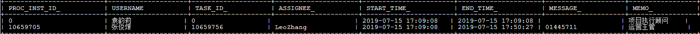
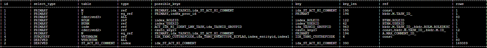

# SQL优化经典案例（二）

## 简介

SQL语句当中有union all时，我们该如何优化呢？

## 完整SQL语句

```sql
SELECT 0 AS PROC_INST_ID_, BURM.USERNAME, 0 AS TASK_ID_, '' AS ASSIGNEE_, btxmas.LASTMODDATE AS START_TIME_
	, btxmas.LASTMODDATE AS END_TIME_, '' AS MESSAGE_, ROLM.ROLEDESC AS MEMO_
FROM VBTXMASM btxmas
	LEFT JOIN (
		SELECT TXNO, MAX(ACCEPTOPINION) AS ACCEPTOPINION
		FROM VLOAAPLE
		GROUP BY TXNO
		UNION ALL
		SELECT TXNO, MAX(ACCEPTOPINION) AS ACCEPTOPINION
		FROM VLOAMASE
		GROUP BY TXNO
	) mase ON mase.TXNO = btxmas.TXNO
	LEFT JOIN VSECBURM BURM ON BURM.USERID = btxmas.LASTMODUSER
	LEFT JOIN (SELECT MIN(ROLEID) AS ROLEID, USERID
		FROM VSECBTRM
		GROUP BY USERID
		) BTRM ON BTRM.USERID = BURM.USERID
	LEFT JOIN VSECROLM ROLM ON ROLM.ROLEID = BTRM.ROLEID
WHERE btxmas.txno = '817648'
UNION ALL
SELECT T.PROC_INST_ID_, BURM.USERNAME, T.ID_ AS TASK_ID_, T.ASSIGNEE_, T.START_TIME_
	, T.END_TIME_, NVL(N.MESSAGE_, '') AS MESSAGE_, ROLM.ROLEDESC AS MEMO_
FROM ST_ACT_HI_TASKINST T
	LEFT JOIN (SELECT PROC_INST_ID_, TASK_ID_, MIN(ID_) AS MIN_COMMENT_ID_, MAX(ID_) AS MAX_COMMENT_ID_
		FROM ST_ACT_HI_COMMENT
		GROUP BY PROC_INST_ID_, TASK_ID_
		) A ON A.PROC_INST_ID_ = T.PROC_INST_ID_
		AND A.TASK_ID_ = T.ID_
	LEFT JOIN ST_ACT_HI_COMMENT M ON M.PROC_INST_ID_ = T.PROC_INST_ID_
		AND M.TASK_ID_ = T.ID_
		AND M.ID_ = A.MIN_COMMENT_ID_
	LEFT JOIN ST_ACT_HI_COMMENT N ON N.PROC_INST_ID_ = T.PROC_INST_ID_
		AND N.TASK_ID_ = T.ID_
		AND N.ID_ = A.MAX_COMMENT_ID_
	LEFT JOIN VSECBURM BURM ON BURM.USERID = T.ASSIGNEE_
	LEFT JOIN (SELECT ROLEID, USERID
		FROM VSECBTRM
		) BTRM ON BTRM.USERID = BURM.USERID
	LEFT JOIN VSECROLM ROLM ON ROLM.ROLEID = BTRM.ROLEID
	LEFT JOIN ST_ACT_HI_IDENTITYLINK inde ON ROLM.ROLEDESC = inde.GROUP_ID_
WHERE m.MESSAGE_ IS NOT NULL
	AND m.MESSAGE_ = '同意'
	AND inde.TASK_ID_ = T.ID_
	AND T.PROC_INST_ID_ = (
		SELECT DISTINCT entityid
		FROM VBTXMASM
		WHERE txno = '817648'
		)
ORDER BY TASK_ID_ ASC

耗时：1857ms
```



*注：此SQL语句由unio all连接，可分成上下两部分分别优化*

### 问题定位

*通过拆分以上SQL分成两部分优化*

#### SQL1

```sql
SELECT T.PROC_INST_ID_, BURM.USERNAME, T.ID_ AS TASK_ID_, T.ASSIGNEE_, T.START_TIME_
	, T.END_TIME_, NVL(N.MESSAGE_, '') AS MESSAGE_, ROLM.ROLEDESC AS MEMO_
FROM ST_ACT_HI_TASKINST T
	LEFT JOIN (SELECT PROC_INST_ID_, TASK_ID_, MIN(ID_) AS MIN_COMMENT_ID_, MAX(ID_) AS MAX_COMMENT_ID_
		FROM ST_ACT_HI_COMMENT
		GROUP BY PROC_INST_ID_, TASK_ID_
		) A ON A.PROC_INST_ID_ = T.PROC_INST_ID_
		AND A.TASK_ID_ = T.ID_
	LEFT JOIN ST_ACT_HI_COMMENT M ON M.PROC_INST_ID_ = T.PROC_INST_ID_
		AND M.TASK_ID_ = T.ID_
		AND M.ID_ = A.MIN_COMMENT_ID_
	LEFT JOIN ST_ACT_HI_COMMENT N ON N.PROC_INST_ID_ = T.PROC_INST_ID_
		AND N.TASK_ID_ = T.ID_
		AND N.ID_ = A.MAX_COMMENT_ID_
	LEFT JOIN VSECBURM BURM ON BURM.USERID = T.ASSIGNEE_
	LEFT JOIN (SELECT ROLEID, USERID
		FROM VSECBTRM
		) BTRM ON BTRM.USERID = BURM.USERID
	LEFT JOIN VSECROLM ROLM ON ROLM.ROLEID = BTRM.ROLEID
	LEFT JOIN ST_ACT_HI_IDENTITYLINK inde ON ROLM.ROLEDESC = inde.GROUP_ID_
WHERE m.MESSAGE_ IS NOT NULL
	AND m.MESSAGE_ = '同意'
	AND inde.TASK_ID_ = T.ID_
	AND T.PROC_INST_ID_ = (
		SELECT DISTINCT entityid
		FROM VBTXMASM
		WHERE txno = '817648'
		)
ORDER BY TASK_ID_ ASC

--耗时：1110 ms.
```
##### SQL1执行计划



由执行计划预测，子查询结果集可能是导致语句低效的原因

```sql
SELECT T.PROC_INST_ID_, BURM.USERNAME, T.ID_ AS TASK_ID_, T.ASSIGNEE_, T.START_TIME_
	, T.END_TIME_, NVL(N.MESSAGE_, '') AS MESSAGE_, ROLM.ROLEDESC AS MEMO_
FROM ST_ACT_HI_TASKINST T
	LEFT JOIN (SELECT PROC_INST_ID_, TASK_ID_, MIN(ID_) AS MIN_COMMENT_ID_, MAX(ID_) AS MAX_COMMENT_ID_
		FROM ST_ACT_HI_COMMENT
		GROUP BY PROC_INST_ID_, TASK_ID_
		) A ON A.PROC_INST_ID_ = T.PROC_INST_ID_
		AND A.TASK_ID_ = T.ID_

--耗时 898ms
```

*注：可以看出效率低下的原因为子查询结果集太大，导致连接时扫描的行数太多*

##### SQL1改写

需要缩小结果集来优化此SQL

```sql
SELECT T.PROC_INST_ID_, BURM.USERNAME, T.ID_ AS TASK_ID_, T.ASSIGNEE_, T.START_TIME_
	, T.END_TIME_, NVL(N.MESSAGE_, '') AS MESSAGE_, ROLM.ROLEDESC AS MEMO_
FROM ST_ACT_HI_TASKINST T
	LEFT JOIN (SELECT PROC_INST_ID_,MIN(ID_) AS MIN_COMMENT_ID_, MAX(ID_) AS MAX_COMMENT_ID_
		FROM ST_ACT_HI_COMMENT where PROC_INST_ID_ = (SELECT DISTINCT entityid
		FROM VBTXMASM
		WHERE txno = '817648'
		)) A ON A.PROC_INST_ID_ = T.PROC_INST_ID_
	LEFT JOIN ST_ACT_HI_COMMENT M ON M.PROC_INST_ID_ = T.PROC_INST_ID_
		AND M.TASK_ID_ = T.ID_
		AND M.ID_ = A.MIN_COMMENT_ID_
	LEFT JOIN ST_ACT_HI_COMMENT N ON N.PROC_INST_ID_ = T.PROC_INST_ID_
		AND N.TASK_ID_ = T.ID_
		AND N.ID_ = A.MAX_COMMENT_ID_
	LEFT JOIN VSECBURM BURM ON BURM.USERID = T.ASSIGNEE_
	LEFT JOIN (SELECT ROLEID, USERID
		FROM VSECBTRM
		) BTRM ON BTRM.USERID = BURM.USERID
	LEFT JOIN VSECROLM ROLM ON ROLM.ROLEID = BTRM.ROLEID
	LEFT JOIN ST_ACT_HI_IDENTITYLINK inde ON ROLM.ROLEDESC = inde.GROUP_ID_
WHERE m.MESSAGE_ IS NOT NULL
	AND m.MESSAGE_ = '同意'
	AND inde.TASK_ID_ = T.ID_
	AND T.PROC_INST_ID_ = (
		SELECT DISTINCT entityid
		FROM VBTXMASM
		WHERE txno = '817648'
		)
ORDER BY TASK_ID_ ASC
--耗时：5ms
```

### SQL2

```sql
SELECT 0 AS PROC_INST_ID_, BURM.USERNAME, 0 AS TASK_ID_, '' AS ASSIGNEE_, btxmas.LASTMODDATE AS START_TIME_
	, btxmas.LASTMODDATE AS END_TIME_, '' AS MESSAGE_, ROLM.ROLEDESC AS MEMO_
FROM VBTXMASM btxmas
	LEFT JOIN (
		SELECT TXNO, MAX(ACCEPTOPINION) AS ACCEPTOPINION
		FROM VLOAAPLE
		GROUP BY TXNO
		UNION ALL
		SELECT TXNO, MAX(ACCEPTOPINION) AS ACCEPTOPINION
		FROM VLOAMASE
		GROUP BY TXNO
	) mase ON mase.TXNO = btxmas.TXNO
	LEFT JOIN VSECBURM BURM ON BURM.USERID = btxmas.LASTMODUSER
	LEFT JOIN (SELECT MIN(ROLEID) AS ROLEID, USERID
		FROM VSECBTRM
		GROUP BY USERID
		) BTRM ON BTRM.USERID = BURM.USERID
	LEFT JOIN VSECROLM ROLM ON ROLM.ROLEID = BTRM.ROLEID
WHERE btxmas.txno = '817648'

--耗时：784ms
```

*SQL2同理SQL1*

#####　SQL2改写

```sql
SELECT 0 AS PROC_INST_ID_, BURM.USERNAME, 0 AS TASK_ID_, '' AS ASSIGNEE_, btxmas.LASTMODDATE AS START_TIME_
	, btxmas.LASTMODDATE AS END_TIME_, '' AS MESSAGE_, ROLM.ROLEDESC AS MEMO_
FROM VBTXMASM btxmas
	LEFT JOIN (
		SELECT TXNO, MAX(ACCEPTOPINION) AS ACCEPTOPINION
		FROM VLOAMASE where TXNO='817648'
	) mase ON mase.TXNO = btxmas.TXNO
	LEFT JOIN VSECBURM BURM ON BURM.USERID = btxmas.LASTMODUSER
	LEFT JOIN (SELECT MIN(ROLEID) AS ROLEID, USERID
		FROM VSECBTRM
		GROUP BY USERID
		) BTRM ON BTRM.USERID = BURM.USERID
	LEFT JOIN VSECROLM ROLM ON ROLM.ROLEID = BTRM.ROLEID
WHERE btxmas.txno = '817648'

--耗时：5ms
```

### 改写后的SQL整合

```sql
SELECT 0 AS PROC_INST_ID_, BURM.USERNAME, 0 AS TASK_ID_, '' AS ASSIGNEE_, btxmas.LASTMODDATE AS START_TIME_
	, btxmas.LASTMODDATE AS END_TIME_, '' AS MESSAGE_, ROLM.ROLEDESC AS MEMO_
FROM VBTXMASM btxmas
	LEFT JOIN (
		SELECT TXNO, MAX(ACCEPTOPINION) AS ACCEPTOPINION
		FROM VLOAMASE where TXNO='817648'
	) mase ON mase.TXNO = btxmas.TXNO
	LEFT JOIN VSECBURM BURM ON BURM.USERID = btxmas.LASTMODUSER
	LEFT JOIN (SELECT MIN(ROLEID) AS ROLEID, USERID
		FROM VSECBTRM
		GROUP BY USERID
		) BTRM ON BTRM.USERID = BURM.USERID
	LEFT JOIN VSECROLM ROLM ON ROLM.ROLEID = BTRM.ROLEID
WHERE btxmas.txno = '817648'
UNION ALL
SELECT T.PROC_INST_ID_, BURM.USERNAME, T.ID_ AS TASK_ID_, T.ASSIGNEE_, T.START_TIME_
	, T.END_TIME_, NVL(N.MESSAGE_, '') AS MESSAGE_, ROLM.ROLEDESC AS MEMO_
FROM ST_ACT_HI_TASKINST T
	LEFT JOIN (SELECT PROC_INST_ID_,MIN(ID_) AS MIN_COMMENT_ID_, MAX(ID_) AS MAX_COMMENT_ID_
		FROM ST_ACT_HI_COMMENT where PROC_INST_ID_ = (SELECT DISTINCT entityid
		FROM VBTXMASM
		WHERE txno = '817648'
		)) A ON A.PROC_INST_ID_ = T.PROC_INST_ID_
	LEFT JOIN ST_ACT_HI_COMMENT M ON M.PROC_INST_ID_ = T.PROC_INST_ID_
		AND M.TASK_ID_ = T.ID_
		AND M.ID_ = A.MIN_COMMENT_ID_
	LEFT JOIN ST_ACT_HI_COMMENT N ON N.PROC_INST_ID_ = T.PROC_INST_ID_
		AND N.TASK_ID_ = T.ID_
		AND N.ID_ = A.MAX_COMMENT_ID_
	LEFT JOIN VSECBURM BURM ON BURM.USERID = T.ASSIGNEE_
	LEFT JOIN (SELECT ROLEID, USERID
		FROM VSECBTRM
		) BTRM ON BTRM.USERID = BURM.USERID
	LEFT JOIN VSECROLM ROLM ON ROLM.ROLEID = BTRM.ROLEID
	LEFT JOIN ST_ACT_HI_IDENTITYLINK inde ON ROLM.ROLEDESC = inde.GROUP_ID_
WHERE m.MESSAGE_ IS NOT NULL
	AND m.MESSAGE_ = '同意'
	AND inde.TASK_ID_ = T.ID_
	AND T.PROC_INST_ID_ = (
		SELECT DISTINCT entityid
		FROM VBTXMASM
		WHERE txno = '817648'
		)
ORDER BY TASK_ID_ ASC

--耗时：7ms
```

*改写后结果与原SQL相同*

## 优化后结果对比

| 序号        | 优化前 | 优化后 | 备注                  |
| ----------- | ------ | ------ | --------------------- |
| 1           | 1110ms | 5ms    | SQL改写（缩小结果集） |
| 2           | 784ms  | 5ms    | SQL改写（缩小结果集） |
| 完整SQL语句 | 1857ms | 7ms    | SQL改写（缩小结果集） |

## 总结

- 该条SQL语句由union all 两条语句组成，分成上下两部分进行优化
- 上半部分通过执行机会获取子查询效率扫描行数最多，导致效率慢
- 通过缩小子查询的结果集进行改写


