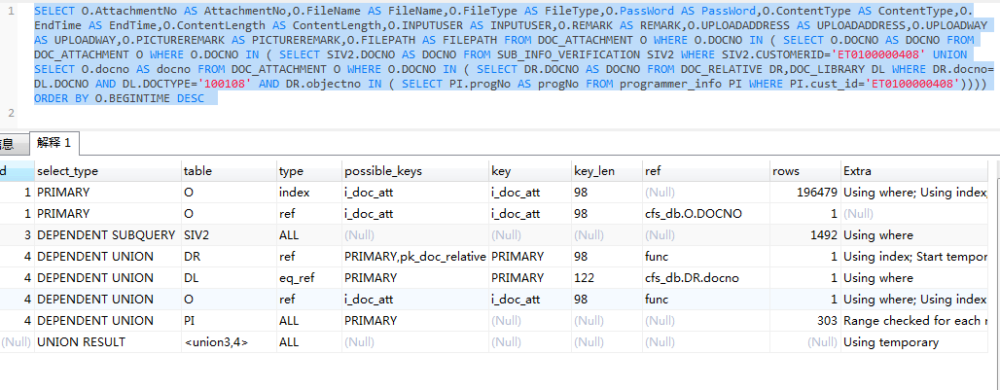
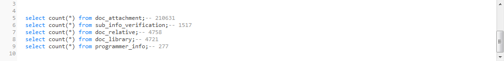
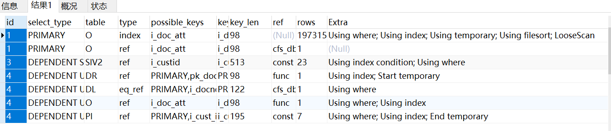

# 中合担保SQL优化 v.2019.12.11

[TOC]

## 源SQL

```sql
SELECT
	O.AttachmentNo AS AttachmentNo,
	O.FileName AS FileName,
	O.FileType AS FileType,
	O. PASSWORD AS PASSWORD,
	O.ContentType AS ContentType,
	O.EndTime AS EndTime,
	O.ContentLength AS ContentLength,
	O.INPUTUSER AS INPUTUSER,
	O.REMARK AS REMARK,
	O.UPLOADADDRESS AS UPLOADADDRESS,
	O.UPLOADWAY AS UPLOADWAY,
	O.PICTUREREMARK AS PICTUREREMARK,
	O.FILEPATH AS FILEPATH
FROM
	DOC_ATTACHMENT O
WHERE
	O.DOCNO IN (
		SELECT
			O.DOCNO AS DOCNO
		FROM
			DOC_ATTACHMENT O
		WHERE
			O.DOCNO IN (
				SELECT
					SIV2.DOCNO AS DOCNO
				FROM
					SUB_INFO_VERIFICATION SIV2
				WHERE
					SIV2.CUSTOMERID = 'ET0100000408'
				UNION
					SELECT
						O.docno AS docno
					FROM
						DOC_ATTACHMENT O
					WHERE
						O.DOCNO IN (
							SELECT
								DR.DOCNO AS DOCNO
							FROM
								DOC_RELATIVE DR,
								DOC_LIBRARY DL
							WHERE
								DR.docno = DL.DOCNO
							AND DL.DOCTYPE = '100108'
							AND DR.objectno IN (
								SELECT
									PI.progNo AS progNo
								FROM
									programmer_info PI
								WHERE
									PI.cust_id = 'ET0100000408'
							)
						)
			)
	)
ORDER BY
	O.BEGINTIME DESC

39.821s 8条
```







```sql
CREATE TABLE `doc_attachment` (
  `DOCNO` varchar(32) CHARACTER SET utf8 COLLATE utf8_bin NOT NULL,
  `ATTACHMENTNO` varchar(32) CHARACTER SET utf8 COLLATE utf8_bin NOT NULL,
  `FILENAME` varchar(250) CHARACTER SET utf8 COLLATE utf8_bin DEFAULT NULL,
  `CONTENTTYPE` varchar(80) CHARACTER SET utf8 COLLATE utf8_bin DEFAULT NULL,
  `CONTENTLENGTH` varchar(32) CHARACTER SET utf8 COLLATE utf8_bin DEFAULT NULL,
  `CONTENTSTATUS` varchar(18) CHARACTER SET utf8 COLLATE utf8_bin DEFAULT NULL,
  `BEGINTIME` varchar(20) CHARACTER SET utf8 COLLATE utf8_bin DEFAULT NULL,
  `ENDTIME` varchar(20) CHARACTER SET utf8 COLLATE utf8_bin DEFAULT NULL,
  `DOCCONTENT` mediumtext,
  `INPUTUSER` varchar(32) CHARACTER SET utf8 COLLATE utf8_bin DEFAULT NULL,
  `INPUTORG` varchar(32) CHARACTER SET utf8 COLLATE utf8_bin DEFAULT NULL,
  `INPUTTIME` varchar(20) CHARACTER SET utf8 COLLATE utf8_bin DEFAULT NULL,
  `UPDATEUSER` varchar(32) CHARACTER SET utf8 COLLATE utf8_bin DEFAULT NULL,
  `UPDATETIME` varchar(20) CHARACTER SET utf8 COLLATE utf8_bin DEFAULT NULL,
  `REMARK` varchar(250) CHARACTER SET utf8 COLLATE utf8_bin DEFAULT NULL,
  `filepath` varchar(320) DEFAULT NULL,
  `FULLPATH` varchar(200) CHARACTER SET utf8 COLLATE utf8_bin DEFAULT NULL,
  `FILESAVEMODE` varchar(18) CHARACTER SET utf8 COLLATE utf8_bin DEFAULT NULL,
  `FILETYPE` varchar(10) CHARACTER SET utf8 COLLATE utf8_bin DEFAULT NULL,
  `ALIYUNKEY` varchar(100) DEFAULT NULL COMMENT '阿里云key',
  `PASSWORD` varchar(20) CHARACTER SET utf8 COLLATE utf8_bin DEFAULT NULL COMMENT 'URL密码',
  `UPLOADADDRESS` varchar(255) DEFAULT NULL COMMENT '上传地址',
  `UPLOADWAY` varchar(10) DEFAULT NULL COMMENT '上传方式',
  `PICTUREREMARK` varchar(1000) DEFAULT NULL COMMENT '图片备注说明',
  PRIMARY KEY (`ATTACHMENTNO`,`DOCNO`),
  KEY `i_doc_att` (`DOCNO`) USING BTREE
) ENGINE=InnoDB DEFAULT CHARSET=utf8


CREATE TABLE `sub_info_verification` (
  `VERSERIALNO` varchar(255) CHARACTER SET utf8 COLLATE utf8_bin NOT NULL COMMENT '核查流水号',
  `QUERYTIME` varchar(255) DEFAULT NULL COMMENT '查询时间',
  `QUERYDEP` varchar(255) DEFAULT NULL COMMENT '查询部门',
  `QUERYPERSON` varchar(255) DEFAULT NULL COMMENT '查询人员',
  `EXCINFOSITUATION` varchar(255) DEFAULT NULL COMMENT '异常信息情况',
  `ENTINFOVERREPSTATUS` varchar(255) DEFAULT NULL COMMENT '企业信息核查报告状态',
  `CUSTOMERID` varchar(255) DEFAULT NULL COMMENT '客户编号',
  `CUSTOMERNAME` varchar(255) DEFAULT NULL COMMENT '客户名称',
  `EXCINFOEXPLAIN` varchar(255) DEFAULT NULL COMMENT '异常信息说明',
  `PDFURL` varchar(255) DEFAULT NULL COMMENT 'PDF报告下载链接',
  `WORDURL` varchar(255) DEFAULT NULL COMMENT 'word报告下载链接',
  `VerPhase` varchar(80) DEFAULT NULL COMMENT '核查阶段',
  `DOCNO` varchar(255) DEFAULT NULL COMMENT '文档编号',
  PRIMARY KEY (`VERSERIALNO`),
  KEY `i_custid` (`CUSTOMERID`) USING BTREE,
  KEY `i_DOCNO` (`DOCNO`) USING BTREE
) ENGINE=InnoDB DEFAULT CHARSET=gbk

CREATE TABLE `doc_relative` (
  `docno` varchar(32) COLLATE utf8_bin NOT NULL,
  `objecttype` varchar(40) COLLATE utf8_bin NOT NULL,
  `objectno` varchar(32) COLLATE utf8_bin NOT NULL,
  `objectname` varchar(80) COLLATE utf8_bin DEFAULT NULL,
  PRIMARY KEY (`docno`,`objecttype`,`objectno`),
  UNIQUE KEY `pk_doc_relative` (`docno`,`objecttype`,`objectno`)
) ENGINE=InnoDB DEFAULT CHARSET=utf8 COLLATE=utf8_bin

CREATE TABLE `doc_library` (
  `DOCNO` varchar(40) CHARACTER SET utf8 COLLATE utf8_bin NOT NULL,
  `DOCTYPE` varchar(18) CHARACTER SET utf8 COLLATE utf8_bin DEFAULT '',
  `SUBDOCTYPE` varchar(18) CHARACTER SET utf8 COLLATE utf8_bin DEFAULT '',
  `DOCTITLE` varchar(80) CHARACTER SET utf8 COLLATE utf8_bin DEFAULT NULL,
  `DOCSOURCE` varchar(80) CHARACTER SET utf8 COLLATE utf8_bin DEFAULT NULL,
  `DOCUNIT` varchar(80) CHARACTER SET utf8 COLLATE utf8_bin DEFAULT NULL,
  `DOCDATE` varchar(10) CHARACTER SET utf8 COLLATE utf8_bin DEFAULT NULL,
  `DOCORGANIZER` varchar(80) CHARACTER SET utf8 COLLATE utf8_bin DEFAULT NULL,
  `DOCKEYWORD` varchar(250) CHARACTER SET utf8 COLLATE utf8_bin DEFAULT NULL,
  `DOCABSTRACT` varchar(250) CHARACTER SET utf8 COLLATE utf8_bin DEFAULT NULL,
  `INPUTUSERID` varchar(32) CHARACTER SET utf8 COLLATE utf8_bin DEFAULT NULL,
  `INPUTORGID` varchar(80) CHARACTER SET utf8 COLLATE utf8_bin DEFAULT NULL,
  `INPUTTIME` varchar(20) CHARACTER SET utf8 COLLATE utf8_bin DEFAULT NULL,
  `UPDATEUSERIUD` varchar(32) CHARACTER SET utf8 COLLATE utf8_bin DEFAULT NULL,
  `UPDATETIME` varchar(20) CHARACTER SET utf8 COLLATE utf8_bin DEFAULT NULL,
  `SORTNO` varchar(32) CHARACTER SET utf8 COLLATE utf8_bin DEFAULT NULL,
  `REMARK` varchar(400) CHARACTER SET utf8 COLLATE utf8_bin DEFAULT NULL,
  PRIMARY KEY (`DOCNO`),
  KEY `i_docno` (`DOCNO`,`DOCTYPE`) USING BTREE
) ENGINE=InnoDB DEFAULT CHARSET=utf8 COMMENT='附件信息'
```

## 排序字段优化

依据执行计划将排序字段添加到索引中：

```sql
alter table drop index  i_doc_att;

alter table add index i_doc_att('DOCNO','BEGINTIME')
```

> 通过验证，对性能提升没作用。已回退。

## 子句拆分查找原因

通过由内到外拆分SQL，查找原因：

```sql
SELECT
	PI.progNo AS progNo
FROM
	programmer_info PI
WHERE
	PI.cust_id = 'ET0100000408'
	
0.802S  7条


SELECT
	DR.DOCNO AS DOCNO
FROM
	DOC_RELATIVE DR,
	DOC_LIBRARY DL
WHERE
	DR.docno = DL.DOCNO
AND DL.DOCTYPE = '100108'
AND DR.objectno IN (
	SELECT
		PI.progNo AS progNo
	FROM
		programmer_info PI
	WHERE
		PI.cust_id = 'ET0100000408'
)
0.551S 5条

SELECT
	O.docno AS docno
FROM
	DOC_ATTACHMENT O
WHERE
	O.DOCNO IN (
		SELECT
			DR.DOCNO AS DOCNO
		FROM
			DOC_RELATIVE DR,
			DOC_LIBRARY DL
		WHERE
			DR.docno = DL.DOCNO
		AND DL.DOCTYPE = '100108'
		AND DR.objectno IN (
			SELECT
				PI.progNo AS progNo
			FROM
				programmer_info PI
			WHERE
				PI.cust_id = 'ET0100000408'
		)
	)
0.500S 4条

SELECT
	SIV2.DOCNO AS DOCNO
FROM
	SUB_INFO_VERIFICATION SIV2
WHERE
	SIV2.CUSTOMERID = 'ET0100000408'
UNION
	SELECT
		O.docno AS docno
	FROM
		DOC_ATTACHMENT O
	WHERE
		O.DOCNO IN (
			SELECT
				DR.DOCNO AS DOCNO
			FROM
				DOC_RELATIVE DR,
				DOC_LIBRARY DL
			WHERE
				DR.docno = DL.DOCNO
			AND DL.DOCTYPE = '100108'
			AND DR.objectno IN (
				SELECT
					PI.progNo AS progNo
				FROM
					programmer_info PI
				WHERE
					PI.cust_id = 'ET0100000408'
			)
		)
0.493S 23条


SELECT
	O.DOCNO AS DOCNO
FROM
	DOC_ATTACHMENT O
WHERE
	O.DOCNO IN (
		SELECT
			SIV2.DOCNO AS DOCNO
		FROM
			SUB_INFO_VERIFICATION SIV2
		WHERE
			SIV2.CUSTOMERID = 'ET0100000408'
		UNION
			SELECT
				O.docno AS docno
			FROM
				DOC_ATTACHMENT O
			WHERE
				O.DOCNO IN (
					SELECT
						DR.DOCNO AS DOCNO
					FROM
						DOC_RELATIVE DR,
						DOC_LIBRARY DL
					WHERE
						DR.docno = DL.DOCNO
					AND DL.DOCTYPE = '100108'
					AND DR.objectno IN (
						SELECT
							PI.progNo AS progNo
						FROM
							programmer_info PI
						WHERE
							PI.cust_id = 'ET0100000408'
					)
				)
	)
	
38.420S  8条

```

>主要原因是DOC_ATTACHMENT.O.DOCNO 字段与SUB_INFO_VERIFICATION.SIV2.DOCNO 比较性能消耗较大。通过比对表的DDL，两边字符集不同。
>
>建议将两张表的字符集调整相同。

## 字符集统一

```
ALTER TABLE  SUB_INFO_VERIFICATION DEFAULT CHARACTER SET utf8 COLLATE utf8_bin; --字段未修改没有作用


ALTER TABLE  SUB_INFO_VERIFICATION CONVERT TO CHARACTER SET utf8 COLLATE utf8_bin; --字段修改时间稍许提升
```

> 31.680S


采用结果放到in当中直接执行：

```sql
SELECT
	O.DOCNO AS DOCNO
FROM
	DOC_ATTACHMENT O
WHERE
	O.DOCNO IN (
2017121300000049,
2017122800000016,
2017122800000045,
2018042400000028,
2018062400000002,
2018082400000004,
2018092400000002,
2018102400000002,
2018112400000002,
2018122400000002,
2019012400000025,
2019030400000015,
2019032400000001,
2019042500000001,
2019052400000023,
2019062400000077,
2019072400000020,
2019082400000001,
2019092400000008,
2019092600000001,
2019102400000004,
2019112400000012,
2019120900000007,
2019010800000016,
2019010800000030,
2019091800000010)

0.541s  8条

2017122800000045
2018042400000028
2018062400000002
2018122400000002
2019010800000016
2019010800000030
2019091800000010
2019091800000010
```

## IN改为JOIN

通过改写该句，将in改为jion

```sql
SELECT
	O.DOCNO AS DOCNO
FROM
	DOC_ATTACHMEN O
join (SELECT
			SIV2.DOCNO AS DOCNO
		FROM
			SUB_INFO_VERIFICATION SIV2
		WHERE
			SIV2.CUSTOMERID = 'ET0100000408'
		UNION
			SELECT
				O.docno AS docno
			FROM
				DOC_ATTACHMENT O
			WHERE
				O.DOCNO IN (
					SELECT
						DR.DOCNO AS DOCNO
					FROM
						DOC_RELATIVE DR,
						DOC_LIBRARY DL
					WHERE
						DR.docno = DL.DOCNO
					AND DL.DOCTYPE = '100108'
					AND DR.objectno IN (
						SELECT
							PI.progNo AS progNo
						FROM
							programmer_info PI
						WHERE
							PI.cust_id = 'ET0100000408'
					)
				)) M
ON O.DOCNO = M.DOCNO

0.408S 8条

2017122800000045
2018042400000028
2018062400000002
2018122400000002
2019010800000016
2019010800000030
2019091800000010
2019091800000010
```

## 优化后SQL

```sql
SELECT
	O.AttachmentNo AS AttachmentNo,
	O.FileName AS FileName,
	O.FileType AS FileType,
	O. PASSWORD AS PASSWORD,
	O.ContentType AS ContentType,
	O.EndTime AS EndTime,
	O.ContentLength AS ContentLength,
	O.INPUTUSER AS INPUTUSER,
	O.REMARK AS REMARK,
	O.UPLOADADDRESS AS UPLOADADDRESS,
	O.UPLOADWAY AS UPLOADWAY,
	O.PICTUREREMARK AS PICTUREREMARK,
	O.FILEPATH AS FILEPATH
FROM
	DOC_ATTACHMENT O
join (SELECT
			SIV2.DOCNO AS DOCNO
		FROM
			SUB_INFO_VERIFICATION SIV2
		WHERE
			SIV2.CUSTOMERID = 'ET0100000408'
		UNION
			SELECT
				O.docno AS docno
			FROM
				DOC_ATTACHMENT O
			WHERE
				O.DOCNO IN (
					SELECT
						DR.DOCNO AS DOCNO
					FROM
						DOC_RELATIVE DR,
						DOC_LIBRARY DL
					WHERE
						DR.docno = DL.DOCNO
					AND DL.DOCTYPE = '100108'
					AND DR.objectno IN (
						SELECT
							PI.progNo AS progNo
						FROM
							programmer_info PI
						WHERE
							PI.cust_id = 'ET0100000408'
					)
				)) M
ON O.DOCNO = M.DOCNO
ORDER BY
	O.BEGINTIME DESC

0.484s 8条记录


```

## SQL优化结果

| 序号 | 优化之前 | 优化之后 |
| ---- | -------- | -------- |
| 1    | 39.821s  | 0.484s   |

## 总结

- 字符集修改为一致，性能提升8S，不是最终原因
- 通过将IN子句修改为JOIN方式问题解决
- 最外层的子句多余改写已经撤销掉
